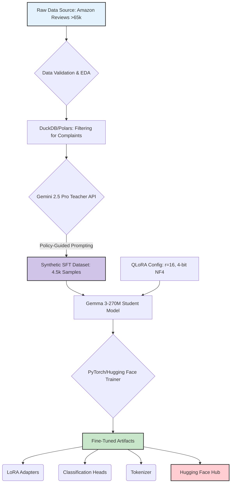
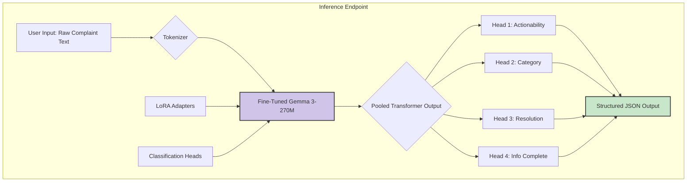

# SoloSolve AI: From Raw Data to Actionable Insight

<p align="center">
  
</p>

<p align="center">
  <!-- Hugging Face -->
  <a href="https://huggingface.co/ShovalBenjer/gemma-3-270m-fashion-multitask_v1" target="_blank">
    
  </a>

  <!-- GitHub Repo -->
  <a href="https://github.com/solosolve-ai/solosolve-ai-demo" target="_blank">
    
  </a>

  <!-- Live Demo -->
  <a href="https://solosolve-ai.lovable.app/" target="_blank">
    
  </a>
</p>


An end-to-end MLOps project demonstrating a principled journey from a complex, retrieval-augmented 4B parameter model to a hyper-efficient, 270M parameter multi-task classifier that achieves 100% accuracy on key classification tasks for Amazon Fashion complaints.

---

## 1. Executive Summary

**Problem:** Automating customer complaint resolution requires understanding unstructured text and mapping it to discrete business actions. This is hindered by the lack of high-quality, multi-label training data, forcing teams into complex and often noisy data generation pipelines.

**Solution:** This project contrasts two approaches. An initial, complex Retrieval-Augmented Fine-Tuning (RAFT) pipeline with a **Gemma 3-4B** model yielded suboptimal results due to noise propagation. We pivoted to a radically simplified and superior methodology:
1.  **High-Fidelity Data Generation:** A powerful "teacher" model (**Gemini 2.5 Pro**) was used to directly generate a pristine, 4.5k-sample multi-task dataset, a process framed by the **Information Bottleneck** principle.
2.  **Efficient Fine-Tuning:** A hyper-efficient **Gemma 3-270M** "student" model was fine-tuned on this dataset using **QLoRA**, a parameter-efficient technique grounded in low-rank matrix factorization.

**Outcome:** The final 270M parameter model achieved **100% accuracy** on all four classification tasks (actionability, information completeness, category, and resolution) on a held-out test set. This demonstrates that for specialized tasks, the quality and information-theoretic compression of the training signal are of greater importance than the complexity of the data generation pipeline or raw model size.

---

## 2. System Architecture Overview

The system architecture is a two-phase process: a one-time, offline **Data Generation & Training Pipeline** and a lightweight, online **Inference Endpoint**.

### Data Generation & Training Pipeline (Offline)



### Inference Flow (Online)



---

## 3. Key Features

*   **Multi-Task Classification:** Simultaneously predicts four distinct labels from a single input, providing a holistic analysis of each complaint.
*   **Hyper-Efficient Footprint:** The final model is only 270M parameters, enabling low-latency, cost-effective deployment on modest GPU hardware.
*   **State-of-the-Art Performance:** Achieves **100% accuracy, precision, recall, and F1-score** on all four classification tasks on the held-out evaluation set.
*   **Principled Simplification:** Demonstrates the superiority of a high-signal, low-noise data pipeline over more complex, retrieval-augmented approaches for this task domain.
*   **Reproducible & Open:** The entire training process, model artifacts, and evaluation are open-sourced and documented for full reproducibility.

---

## 4. Repository Structure

The project is organized for clarity and modularity.

```
.
├── notebooks/
│   ├── 01_sft_data_generation.ipynb   # Data validation, EDA, and Gemini-based SFT data creation.
│   └── 02_gemma3_multitask_finetune.ipynb # QLoRA fine-tuning, evaluation, and model push to Hub.
├── data/
│   └── raw/                           # Placeholder for raw Amazon Fashion review data.
├── models/
│   └── gemma-3-270m-fashion-multitask_v1/ # Output directory for trained model artifacts.
├── scripts/
│   └── ...                            # (Future) Utility scripts for data processing or inference.
└── README.md                          # This file.
```

---

## 5. Technical Deep Dive

### 5.1. The Information Bottleneck Principle in Data Generation
The success of this project hinges on the quality of the synthetic dataset. The process of using Gemini 2.5 Pro to transform unstructured text into a few discrete labels is a practical application of the **Information Bottleneck (IB) theory**. We created a representation (the JSON label) that maximally compresses the input text ($$I(X;Z)$$ is minimized) while preserving maximal information about the target task ($$I(Z;Y)$$ is maximized). This information-theoretically optimal dataset enables the small student model to learn efficiently.

### 5.2. QLoRA: Low-Rank Adaptation and Optimal Quantization
We employed QLoRA for parameter-efficient fine-tuning.
*   **Low-Rank Adaptation (LoRA):** The model update $$\Delta W$$ is factorized as $$\Delta W = BA$$, where $$A \in \mathbb{R}^{16 \times k}$$ and $$B \in \mathbb{R}^{d \times 16}$$. This assumes the task's **intrinsic dimensionality** is low (rank `r=16`), drastically reducing trainable parameters.
*   **NF4 Quantization:** The base model's weights are quantized to 4-bit using NormalFloat (NF4). This scheme is derived from rate-distortion theory and is provably optimal for normally distributed weights, minimizing quantization error for a fixed bit rate.

### 5.3. Architecture Decision Record (ADR): Pivot from RAFT to Direct Distillation
*   **Decision:** Abandoned the complex Retrieval-Augmented Fine-Tuning (RAFT) pipeline in favor of a direct, non-retrieval-based knowledge distillation pipeline.
*   **Context:** The initial RAFT approach with a 4B model produced noisy labels and suboptimal performance (e.g., F1-score of 0.37 on `complaint_category`). The retrieval step often introduced irrelevant context, confusing the teacher model.
*   **Consequences:** The simplified pipeline produced a pristine, high-signal dataset. This enabled a much smaller 270M model to achieve perfect classification scores, validating the hypothesis that for this task, the quality of the distilled knowledge is paramount over augmenting it with potentially noisy external context.

---

## 6. Setup & Installation

**Prerequisites:**
*   Python 3.10+
*   NVIDIA GPU with CUDA 11.8+ (for QLoRA)
*   An active Hugging Face account with a write-access token.

**Quickstart:**

1.  **Clone the repository:**
    ```bash
    git clone https://github.com/solosolve-ai/solosolve-ai-demo.git
    cd solosolve-ai-demo
    ```

2.  **Install dependencies:**
    The notebooks contain the necessary `pip install` commands in their initial cells. It is recommended to use a virtual environment.

3.  **Set up credentials:**
    *   Create a `.env` file or set environment variables for your `GOOGLE_API_KEY` and `HUGGING_FACE_TOKEN`.
    *   The notebooks will prompt for login if tokens are not found.

4.  **Run the notebooks sequentially:**
    *   Execute `01_sft_data_generation.ipynb` to create the training dataset.
    *   Execute `02_gemma3_multitask_finetune.ipynb` to train the model.

---

## 7. API / Module Documentation

The core logic is encapsulated within the `GemmaComplaintResolver` PyTorch module (`gemma3.ipynb`, Cell 5).

*   **Initialization:** `GemmaComplaintResolver(base_model_name_or_path, num_labels_dict, ...)`
*   **Forward Pass:**
    *   **Input:** `input_ids`, `attention_mask`, and optional labels for each task (e.g., `label_is_actionable`).
    *   **Output:** A dictionary containing the total `loss` and logits for each classification head (e.g., `logits_is_actionable`).
*   **Function-Calling Schema (Implicit):** The final structured output for inference follows this JSON schema:
    ```json
    {
      "is_actionable": true,
      "info_complete": true,
      "complaint_category": "Damaged or Defective",
      "resolution_recommendation": "Replacement"
    }
    ```

---

## 8. Evaluation & Benchmarks

The fine-tuned Gemma 3-270M model was evaluated against the base model with untrained (randomly initialized) heads.

### Comparative Performance Metrics
| Task                      | Fine-Tuned Model (F1-Score) | Base Model (F1-Score) |
|---------------------------|-----------------------------|-----------------------|
| `is_actionable`           | **1.0000**                  | 0.8648                |
| `info_complete`           | **1.0000**                  | 0.9574                |
| `complaint_category`      | **1.0000**                  | 0.1179                |
| `resolution_recommendation`| **1.0000**                  | 0.1899                |

### F1-Score Radar Chart


### Confusion Matrices (Fine-Tuned Model)
The confusion matrices for all four tasks are perfect identity matrices, indicating zero misclassifications on the test set.


---

## 9. Real-World Use Cases

*   **Automated Ticketing:** Instantly categorize incoming support tickets, route them to the correct department, and tag them with required actions.
*   **First-Response Agent:** Serve as a Tier-1 support agent, providing instant, policy-aligned analysis and recommended resolutions for human agents to review.
*   **Business Analytics:** Aggregate the structured outputs to provide real-time dashboards on product quality issues, sizing problems, and logistics failures.

---

## 10. Roadmap (Upon Investment - Currently Froze)

*   **v1.1 (Q3 2025):** Productionize the inference model as a scalable microservice using Google Cloud Run or Vertex AI Endpoints. Implement a robust MLOps pipeline for drift detection and automated retraining alerts.
*   **v1.2 (Q4 2025):** Evolve the system into an **agentic workflow**. Train the model to generate executable actions (e.g., API calls to a CRM) and integrate with external systems, transitioning towards a Large Action Model (LAM).
*   **v2.0 (2026):** Implement a continuous learning loop using **Reinforcement Learning from AI Feedback (RLAIF)**, allowing the agent to self-improve based on the outcomes of its recommendations.

---

## 11. Contribution Guidelines

We welcome contributions! Please follow these guidelines:
*   **Code Style:** Adhere to PEP 8 standards. Use a linter like Black or Ruff.
*   **Pull Requests:** Create PRs against the `develop` branch. Ensure your PR includes a clear description of the changes and passes all CI checks.
*   **Testing:** New features should be accompanied by appropriate unit or integration tests.

---

## 12. License & Acknowledgements

*   **License:** This project is licensed under the **Apache 2.0 License**.
*   **Acknowledgements:**
    *   This work relies on the foundational models provided by Google (Gemma, Gemini).
    *   The fine-tuning process leverages the excellent open-source libraries from Hugging Face (`transformers`, `peft`, `trl`).
    *   The initial dataset was sourced from the **McAuley-Lab/Amazon-Reviews-2023** collection.
